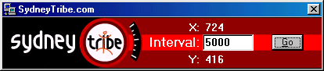

<div align="center">

## SydneyTribe\.com Auto Surf


</div>

### Description

Sydneytribe.com clicks mouse positions saved in mouse.txt
 
### More Info
 
Mouse.txt contains 10 mouse x and y positions.

You can find out the x and y positions on the form.

Open SydneyTribe.com and mouse.txt

Find x,y positions suitable for click.

And copy them to the mouse.txt file.

There is a maximum of 10 clicks included.

You can get a maximum of 100 Tribal Surfer Points per day.

you can get a maximum of 100 SydneyTribe Tribal Surfer Points per day.


<span>             |<span>
---                |---
**Submitted On**   |2000-06-01 20:22:30
**By**             |[mike causa](https://github.com/Planet-Source-Code/PSCIndex/blob/master/ByAuthor/mike-causa.md)
**Level**          |Intermediate
**User Rating**    |5.0 (10 globes from 2 users)
**Compatibility**  |VB 5\.0, VB 6\.0
**Category**       |[Complete Applications](https://github.com/Planet-Source-Code/PSCIndex/blob/master/ByCategory/complete-applications__1-27.md)
**World**          |[Visual Basic](https://github.com/Planet-Source-Code/PSCIndex/blob/master/ByWorld/visual-basic.md)
**Archive File**   |[CODE\_UPLOAD6295612000\.zip](https://github.com/Planet-Source-Code/mike-causa-sydneytribe-com-auto-surf__1-8517/archive/master.zip)

### API Declarations

```
Included with the zip.
Thankz for downloading this.
```


